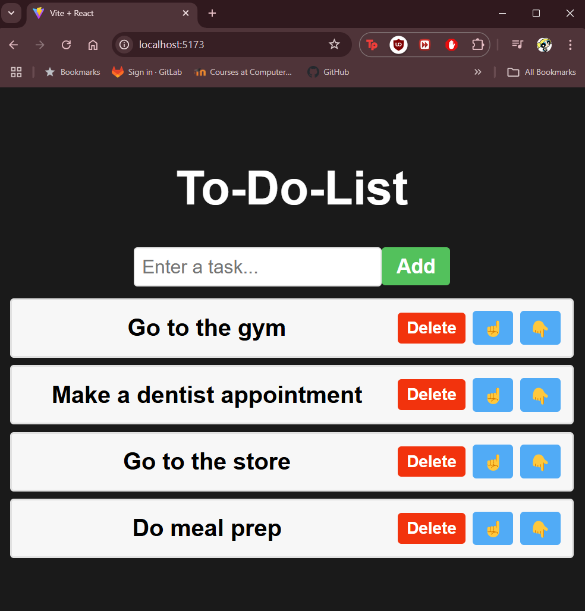

# To-Do List App

A simple To-Do List app that allows users to add, delete and reorder tasks based on priority. 
The app was built with **React** and **Vite**, and uses the **useState()** React Hook. 

